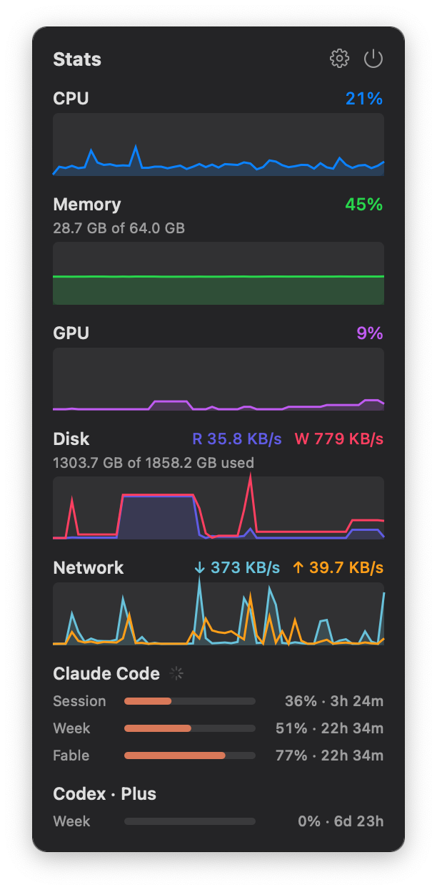
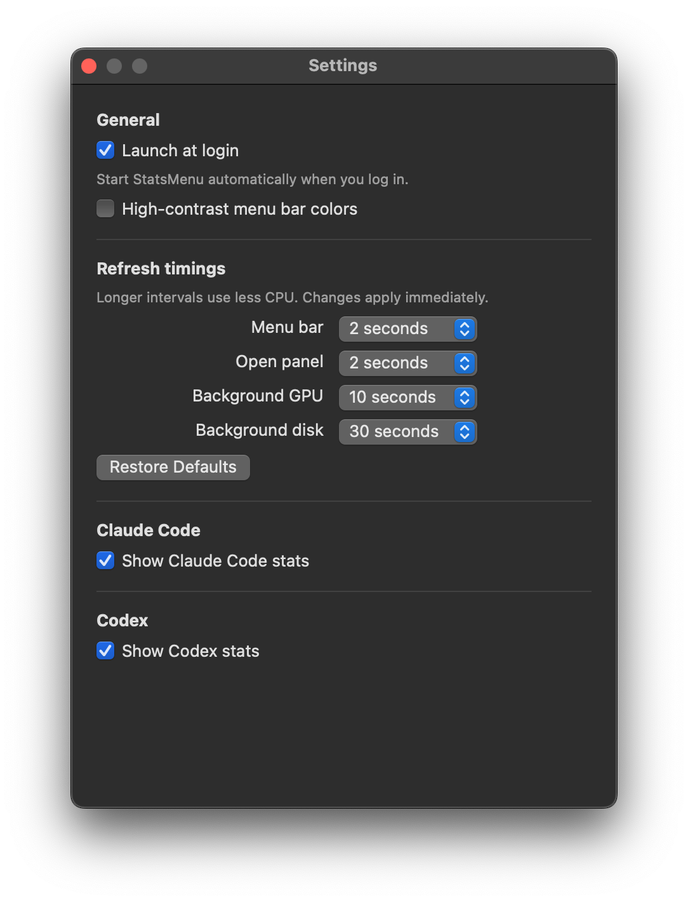

# StatsMenu

A tiny macOS menu bar system monitor. I wanted something simpler and far lighter on resources than
iStat Menus — no bloat, no Electron, just a small native app that shows CPU / Memory / GPU and
network at a glance.




- Native Swift + AppKit, zero third-party dependencies
- ~0.3% CPU idle, ~15 MB RAM
- Menu bar: CPU / Memory / GPU bars + live network ↓/↑
- Click for graphs; hover a metric for its top processes (with app icons)

## Build

Requires macOS 13+ and the Xcode command line tools.

```sh
make                # builds a release binary and packages build/StatsMenu.app
make run            # same, then launches the app
```

That's it — `StatsMenu.app` is a self-contained menu bar app (no dock icon).
